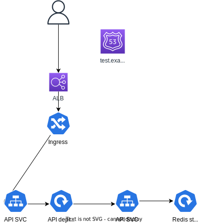

# Revolut

This simple API runs using:
- FastAPI
- Redis for the database
- Kubernetes for the container scheduling

## Architecture


## Local development
This repo is designed for using [tilt](tilt.dev) for local development against a Kubernetes repository (local or remote)

## Deployment
This repository uses Kustomize for deploying it.
You can deploy the base version using:

```
make deploy-base
```

Or the cloud version using:

```
make deploy-cloud
```

Ideally this application would be deployed using a GitOps approach.


